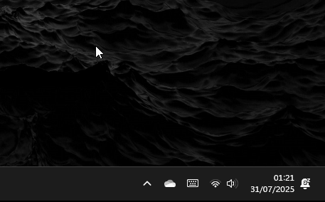
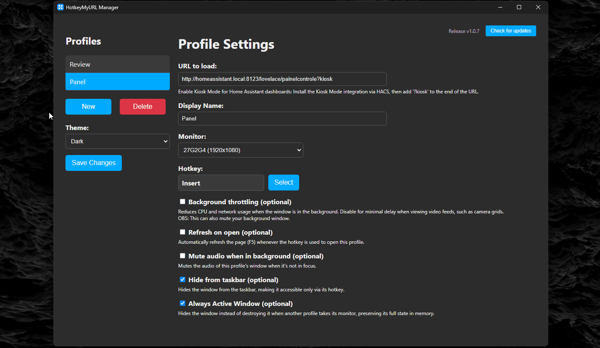

# HotkeyMyURLLikeIts1999
[](https://github.com/MLAN1O/Hotkey1999/releases)
[](https://github.com/MLAN1O/Hotkey1999/releases)
[](https://github.com/MLAN1O/Hotkey1999/blob/main/LICENSE)

Turn any webpage into an instant, native-feeling screen that you can toggle with a global hotkey.
## Table of Contents
- [What’s This?](#whats-this)
- [Cool Features](#cool-features)
- [Quick Demo](#quick-demo)
- [Getting Started](#getting-started)
  - [Install It](#install-it)
  - [How to Use](#how-to-use)
- [Works On](#works-on)
- [Wanna Help?](#wanna-help)
- [License](#license)

## What’s This?

I wanted a faster way to open my go-to web pages — dashboards, feeds, camera views — without dealing with browsers or tabs.

So I made this tool:  
Bind any URL to a hotkey and launch it instantly in a fullscreen window.  
No load time, no clicks — it just appears. Press the same hotkey again, and it’s gone.

Perfect for:
* **Instantly popping up your camera grid, dashboard, or any web tool**
* **Keeping monitoring screens one keystroke away — no browser delays**
* **Dodging tab overload by giving your go-to web app its own shortcut**
* **Feeling like a hacker every time a fullscreen web page appears out of nowhere**

## Cool Features

* ⚡ **Instant Access:** Launch any URL instantly in a clean, borderless window with a global hotkey.

* 🗂️ **Unlimited Profiles:** Create and manage multiple profiles, each with its own URL, hotkey, and custom settings.

* 💻 **Multi-Monitor Support:** Pin each profile to open on a specific monitor in your setup.

* 🧠 **Performance:** Reduce CPU and network usage with background throttling.

* 🪟 **Window Control:** Auto-mute when not active, plus persistent window sizing.

* 🚀 **Lightweight:** Runs silently from the system tray and can be set to launch automatically with Windows.

## Quick Demo

See it in action:

> \*Note: GIFs below show the older UI — updated ones with the new multi-profile manager are on the way!\*

#### From system tray to action:


#### Setting up a profile:


#### Using the hotkey:


## Getting Started

Here’s how to get things rolling.

### Install It

### Option 1: Use the Release (Recommended)

1.  Go to the [Releases page](https://github.com/MLAN1O/Hotkey1999/releases) of this repository.
2.  Download and run the latest installer (`.exe`).

### Option 2: Build from Source

1.  **Run for development:**
    ```bash
    git clone https://github.com/MLAN1O/Hotkey1999.git
    cd Hotkey1999
    npm install
    npm start
    ```

2.  **Build your own executable:**
    ```bash
    npm run dist
    ```
    This will create an installer in the `dist` folder.

### How to Use

Right-click the tray icon and hit `Settings` to manage your profiles.

- Use `New Profile` to add one, or click an existing profile to edit.
- Set a name, URL, and hotkey. You can also configure advanced options for each profile, like the target monitor, auto-refresh on open, and background performance throttling.
- Don’t forget to `Save Changes` when you're done.
- To auto-launch with Windows, just toggle `Start with Windows` in the tray menu.

## Works On

This app was made with Electron and is mainly tested on **Windows**.

It might run on macOS or Linux, but keep in mind:
- The “Start with Windows” option won’t work out of the box.
- You’ll probably need to set up a custom startup script on those platforms.

## Wanna Help?

Contributions are always welcome 🙌
If you’ve got an idea, found a bug, or just want to make things better, check out the [CONTRIBUTING.md](CONTRIBUTING.md) to get started.

## License

This project uses the [MIT License](LICENSE), so feel free to use, modify, and share it.

---

Made with ☕ and way too many hotkeys by **Max L. Mendes**
