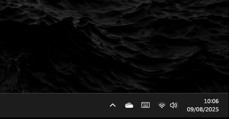

# HotkeyMyURLLikeIts1999

[](https://github.com/MLAN1O/Hotkey1999/releases)
[](https://github.com/MLAN1O/Hotkey1999/releases)
[](https://github.com/MLAN1O/Hotkey1999/blob/main/LICENSE)

Turn any webpage into an instant, native-feeling panel that you can toggle with a global hotkey.

Unlike a browser shortcut, this app runs silently in the background, keeping your page pre-loaded in memory. When you press the hotkey, the window appears **instantly**. No browser launch, no page load, no delay. Press it again, and it vanishes.

## Key Features

* **⚡ Instant Access:** Toggle a fullscreen, borderless window with your content on command.
* **🗂️ Multi-Profile Management:** Create and manage multiple profiles, each with its own unique URL, hotkey, and display name.
* **⚙️ Lightweight & Efficient:** A single, resource-friendly process manages all your hotkey profiles.
* **⌨️ Visual Hotkey Picker:** Easily set up key combinations using a visual keyboard interface, including modifiers like `Ctrl`, `Alt`, `Shift`, and Numpad keys.
* **🚀 Launch on Startup:** Configure the app to start automatically with your operating system for seamless access.

## Demo

*(Note: The GIFs below reflect an older UI. They will be updated soon to showcase the new multi-profile manager.)*

#### Quick access from the system tray:


#### Configuring a profile with a URL and hotkey:


#### Toggling the window with the assigned hotkey:


## Installation

### Option 1: Use the Release (Recommended)

1.  Go to the [Releases page](https://github.com/MLAN1O/Hotkey1999/releases) of this repository.
2.  Download and run the latest installer (`.exe`).

### Option 2: Build from Source

1.  **Run for development:**
    ```bash
    git clone https://github.com/MLAN1O/Hotkey1999.git
    cd Hotkey1999
    npm install
    npm start
    ```

2.  **Build your own executable:**
    ```bash
    npm run dist
    ```
    This will create an installer in the `dist` folder.

## How to Use

Once launched, the application icon will appear in your system tray (near the clock).

1.  **Access Settings:** Right-click the tray icon and select `Settings`.
2.  **Manage Profiles:**
    * To **add a profile**, click the `New Profile` button.
    * To **edit a profile**, select it from the list on the left and modify its `URL`, `Display Name`, and `Hotkey`.
    * To **set a hotkey**, click the `Select` button and use the virtual keyboard to choose your desired key combination, then click `Confirm`.
    * Click `Save Changes` to apply your updates or `Delete Profile` to remove the selected one.
3.  **Enable/Disable Startup:** Right-click the tray icon and check/uncheck `Start with Windows`.

## Compatibility

This application is built with Electron and is primarily tested on **Windows**. While it may work on macOS and Linux, the `Start with Windows` feature is OS-specific and would require manual configuration on other platforms.

---

By Max L. Mendes
